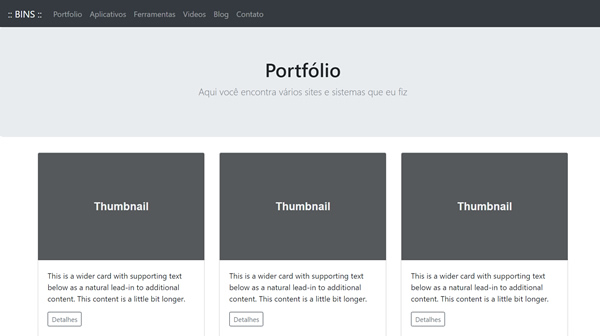

# SITE RESPONSIVO

Este repositório contem uma aplicação React JS. Este é um modelo de layout de um portfólio pessoal feito com Bootstrap. O site é responsivo.

Aqui você pode ver o layout original (HTML)

https://github.com/dbins/responsivo

E aqui você pode ver o mesmo layout implementado no Laravel (PHP)

https://github.com/dbins/responsivo-react

## Instalação

- git clone https://github.com/dbins/responsivo-react
- npm install
- npm run start

Existe na raiz deste projeto um arquivo dockerfile e um arquivo docker-compose para subir este site num container.

## Recursos utilizados

* Redux
* Saga
* ReactoTron
* Boostrap
* Reactstrap

## Configurações extras React JS para padronização de código

### ESLINT

O ESLint é uma ferramenta de lint plugável para JavaScript e JSX

npm install eslint --save-dev
npx eslint --init

### Prettier
O Prettier atualiza seu código automaticamente seguindo os padrões que você quiser toda vez salva o arquivo;

npm install --save-dev --save-exact prettier

Instalação integração Prettier com ESlint
npm install --save-dev eslint-plugin-prettier
npm install --save-dev eslint-config-prettier

npm install --save-dev prettier eslint-config-prettier eslint-plugin-prettier

### Editor Config
O EditorConfig é um formatador de arquivos e coleções em forma de Plugin para Editores de código/texto com o objetivo de manter um padrão de código consistente entre diferentes editores, IDE's ou ambientes;

### Configurações

As configurações destes 3 recursos ficam disponíveis na raiz do projeto.

.editorconfig - Arquivo destinado à configuração do plugin Editor Config, que padroniza algumas configurações para o editor em diferentes ambientes;

.eslintrc.js - Arquivo de configuração do ESLint, é nele que são inseridas as regras e configurações de Linting do projeto

.babelrc - Arquivo de configuração do Babel, é nele que é configurado o Babel Plugin Root Import para aceitar imports absolutos na aplicação usando o diretório src como raiz;

